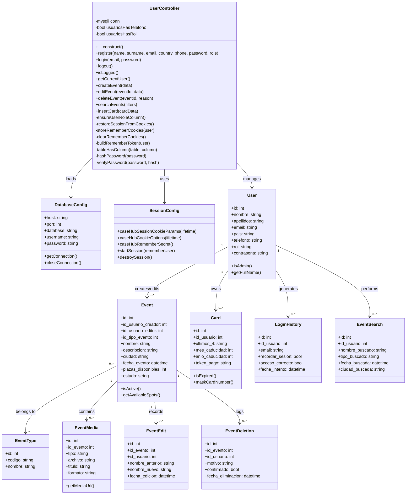
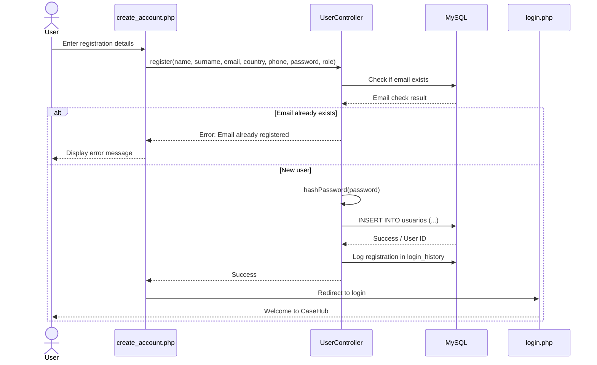
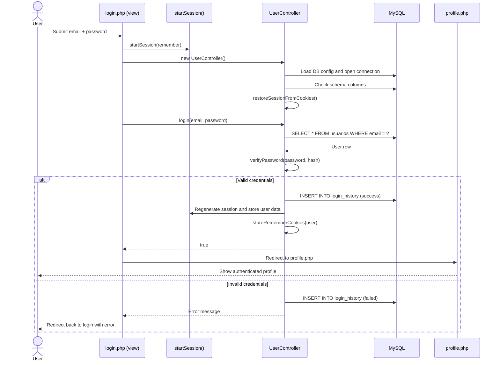
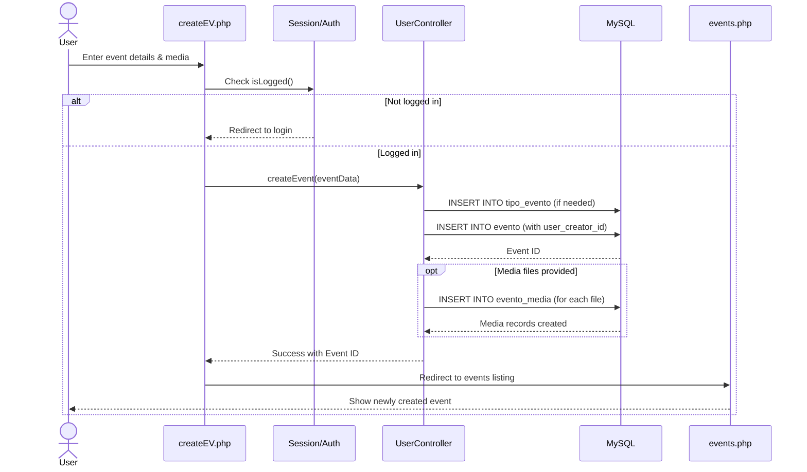
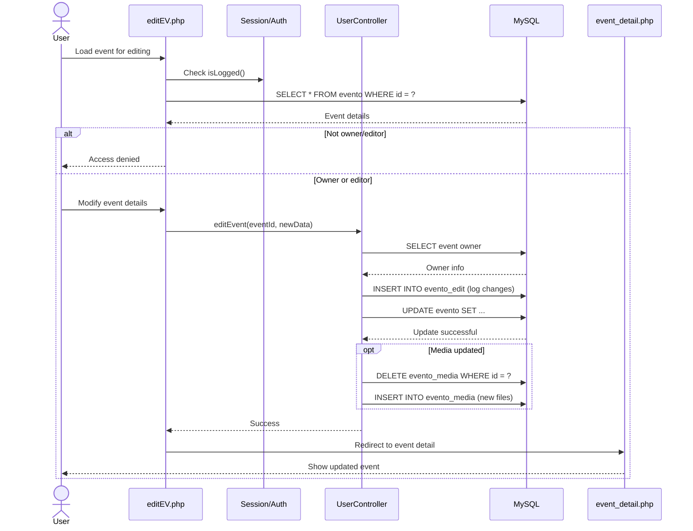
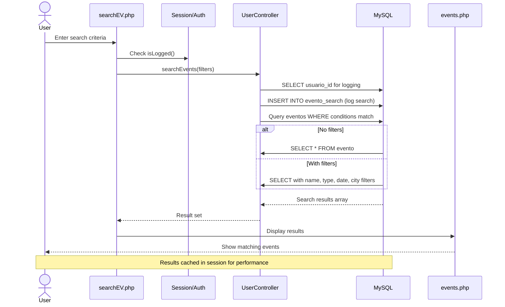
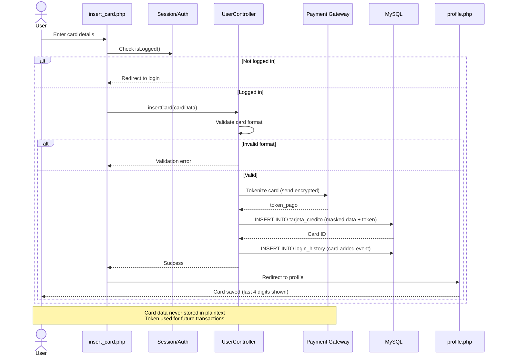

# CaseHub

CaseHub is a PHP and MySQL web application organized with a simple MVC-style structure:

- `config/` contains database and session configuration.
- `controller/` contains the main application controller.
- `model/` contains the SQL schema and stored procedures.
- `view/` contains the PHP, HTML, CSS, JS, and media assets used by the interface.

## Main Components

### Entity-Relationship Class Diagram



## Application Workflows

### 1. User Registration Flow



### 2. Login Sequence



### 3. Event Creation Flow



### 4. Event Editing Flow



### 5. Event Search Flow



### 6. Payment Card Insertion Flow



## Architecture Overview

CaseHub follows a **Model-View-Controller (MVC)** pattern with clear separation of concerns:

```
CaseHub/
├── config/           # Configuration & Initialization
│   ├── database.php  # DB connection config
│   └── session.php   # Session management
├── controller/       # Business Logic
│   └── UserController.php  # Main application controller
├── model/            # Data & Schema
│   └── CaseHUB.sql   # Database schema & procedures
└── view/             # User Interface
    ├── scripts/      # Frontend assets
    ├── assets/       # Media files
    └── html/php/     # Templates & routing
```

### Core Responsibilities

| Layer | Responsibility | Examples |
|-------|----------------|----------|
| **Model** | Database schema, tables, triggers, stored procedures | `usuarios`, `evento`, `tarjeta_credito` tables |
| **Controller** | Business logic, validation, authentication, authorization | `UserController.php` methods |
| **View** | User interface, forms, templates, styling | HTML/PHP templates, CSS, JavaScript |

---

## UserController - Core Methods Explained

### Authentication Methods

**`register(name, surname, email, country, phone, password, role)`**
- Creates new user account with validation
- Hashes password using `hashPassword()` for security
- Dynamically creates `telefono` and `rol` columns if missing
- Returns user ID on success or error message on failure
- Logs attempt in `login_history` table

**`login(email, password)`**
- Verifies email exists in `usuarios` table
- Uses `verifyPassword()` to check against stored hash
- Creates encrypted remember token if "remember me" selected
- Regenerates session to prevent fixation attacks
- Logs login attempt (success/failure) in `login_history`
- Returns true/false to indicate success

**`logout()`**
- Destroys PHP session completely
- Clears remember-me cookies via `clearRememberCookies()`
- Invalidates session in storage/sessions/

**`isLogged()` / `getCurrentUser()`**
- `isLogged()`: Checks if valid session exists
- `getCurrentUser()`: Returns full user object from session
- Called before protected operations (creating events, payments, etc.)

### Event Management Methods

**`createEvent(data)`**
- Validates user is logged in
- Inserts event into `evento` table
- Sets `id_usuario_creador` (creation ownership)
- Handles optional media files via EventMedia table
- Logs event creation in session history

**`editEvent(eventId, data)`**
- Verifies user is event creator or assigned editor
- Creates audit trail in `evento_edit` table (before/after values)
- Updates only allowed fields
- Handles media updates (delete old, insert new)
- Returns error if user lacks permission

**`deleteEvent(eventId, reason)`**
- Implements soft-delete (doesn't remove from DB)
- Creates record in `evento_deletion` table with reason
- Tracks who deleted and when
- Prevents accidental permanent data loss
- Preserves audit trail for compliance

**`searchEvents(filters)`**
- Queries events by name, type, date, city
- Logs search in `evento_search` table for analytics
- Caches results in session for performance
- Returns paginated result set

### Payment Management

**`insertCard(cardData)`**
- Never stores full card details (PCI compliance)
- Tokenizes card through payment gateway
- Stores only: last 4 digits, expiry, token
- Logs card addition as security event
- Masks card display to user (e.g., "•••• •••• •••• 4242")

### Internal Security Methods

**`-hashPassword(password)` / `-verifyPassword(password, hash)`**
- Uses PHP `password_hash()` with bcrypt
- Salt automatically generated per hash
- `verifyPassword()` uses timing-safe comparison
- Protects against rainbow table attacks

**`-storeRememberCookies(user)` / `-clearRememberCookies()`**
- Creates encrypted token via `buildRememberToken()`
- Stores token in database with expiration
- Client receives only encrypted version
- Tokens expire after inactivity period
- Cleared on logout

**`-restoreSessionFromCookies()`**
- On page load, checks for valid remember token
- Rebuilds session if token valid and not expired
- Prevents re-login on every page refresh
- Updates token expiration timestamp

**`-ensureUserRoleColumn()` / `-tableHasColumn(table, column)`**
- Dynamically adds schema columns if missing
- Allows backward compatibility with older databases
- Checks column existence before querying
- Prevents SQL errors on schema mismatches

---

## Database Schema

### Core Tables

#### `usuarios` (Users)
```sql
CREATE TABLE usuarios (
    id INT PRIMARY KEY AUTO_INCREMENT,
    nombre VARCHAR(100),
    apellidos VARCHAR(100),
    email VARCHAR(100) UNIQUE,
    pais VARCHAR(50),
    telefono VARCHAR(20),      -- Added dynamically
    rol VARCHAR(50),           -- Added dynamically
    contrasena VARCHAR(255),   -- bcrypt hash
    fecha_creacion TIMESTAMP DEFAULT CURRENT_TIMESTAMP
);
```
- **Purpose**: Core user account storage
- **Security**: Password stored as bcrypt hash, never plaintext
- **Dynamic Columns**: `telefono` and `rol` can be added on-demand

#### `evento` (Events)
```sql
CREATE TABLE evento (
    id INT PRIMARY KEY AUTO_INCREMENT,
    id_usuario_creador INT,    -- Event creator
    id_usuario_editor INT,     -- Last editor
    id_tipo_evento INT,        -- Event classification
    nombre VARCHAR(200),
    descripcion TEXT,
    ciudad VARCHAR(100),
    fecha_evento DATETIME,     -- When event occurs
    plazas_disponibles INT,    -- Available spots
    estado VARCHAR(50),        -- active/cancelled/completed
    fecha_creacion TIMESTAMP DEFAULT CURRENT_TIMESTAMP,
    FOREIGN KEY (id_usuario_creador) REFERENCES usuarios(id),
    FOREIGN KEY (id_usuario_editor) REFERENCES usuarios(id),
    FOREIGN KEY (id_tipo_evento) REFERENCES tipo_evento(id)
);
```
- **Purpose**: Stores event information
- **Soft Deletion**: Events not deleted, marked inactive
- **Audit Trail**: Both creator and editor tracked

#### `tarjeta_credito` (Payment Cards)
```sql
CREATE TABLE tarjeta_credito (
    id INT PRIMARY KEY AUTO_INCREMENT,
    id_usuario INT,
    ultimos_4 VARCHAR(4),       -- Last 4 digits only
    mes_caducidad INT,          -- Expiry month
    anio_caducidad INT,         -- Expiry year
    token_pago VARCHAR(255),    -- Payment gateway token
    fecha_guardado TIMESTAMP,
    FOREIGN KEY (id_usuario) REFERENCES usuarios(id)
);
```
- **Purpose**: Securely stores payment information
- **PCI Compliance**: Full card number never stored
- **Token-Based**: Uses payment gateway tokenization

#### `evento_edit` (Edit History)
```sql
CREATE TABLE evento_edit (
    id INT PRIMARY KEY AUTO_INCREMENT,
    id_evento INT,
    id_usuario INT,
    nombre_anterior VARCHAR(200),
    nombre_nuevo VARCHAR(200),
    fecha_edicion TIMESTAMP,
    FOREIGN KEY (id_evento) REFERENCES evento(id),
    FOREIGN KEY (id_usuario) REFERENCES usuarios(id)
);
```
- **Purpose**: Audit trail for event changes
- **Tracking**: Records what changed, who changed it, when
- **Compliance**: Enables rollback and historical analysis

#### `evento_media` (Event Media Files)
```sql
CREATE TABLE evento_media (
    id INT PRIMARY KEY AUTO_INCREMENT,
    id_evento INT,
    tipo VARCHAR(50),           -- image/video/audio
    archivo VARCHAR(255),       -- File path
    titulo VARCHAR(200),
    formato VARCHAR(10),        -- jpg/png/mp4/mp3
    FOREIGN KEY (id_evento) REFERENCES evento(id)
);
```
- **Purpose**: Links multimedia to events
- **Storage**: Files in `/view/assets/` directories
- **Organization**: Separated by type (imagenes/, videos/, audio/)

#### `login_history` (Security Audit Log)
```sql
CREATE TABLE login_history (
    id INT PRIMARY KEY AUTO_INCREMENT,
    id_usuario INT,
    email VARCHAR(100),
    recordar_sesion BOOL,       -- "Remember me" used?
    acceso_correcto BOOL,       -- Success/failure
    fecha_intento TIMESTAMP,
    FOREIGN KEY (id_usuario) REFERENCES usuarios(id)
);
```
- **Purpose**: Security monitoring and audit
- **Analytics**: Track login patterns, failed attempts
- **Investigation**: Detect suspicious activity

#### `evento_search` (Search Analytics)
```sql
CREATE TABLE evento_search (
    id INT PRIMARY KEY AUTO_INCREMENT,
    id_usuario INT,
    nombre_buscado VARCHAR(200),
    tipo_buscado VARCHAR(50),
    fecha_buscada DATE,
    ciudad_buscada VARCHAR(100),
    FOREIGN KEY (id_usuario) REFERENCES usuarios(id)
);
```
- **Purpose**: Analytics on user search behavior
- **Insights**: Most searched events, trending locations
- **Improvement**: Optimize event recommendations

#### `evento_deletion` (Deletion Tracking)
```sql
CREATE TABLE evento_deletion (
    id INT PRIMARY KEY AUTO_INCREMENT,
    id_evento INT,
    id_usuario INT,
    motivo VARCHAR(255),        -- Reason for deletion
    confirmado BOOL,
    fecha_eliminacion TIMESTAMP,
    FOREIGN KEY (id_evento) REFERENCES evento(id),
    FOREIGN KEY (id_usuario) REFERENCES usuarios(id)
);
```
- **Purpose**: Soft-delete tracking and recovery
- **Compliance**: Maintain deletion audit trail
- **Recovery**: Can restore events if needed

---

## Configuration

### Database Configuration (`config/database.php`)

```php
// Connects to MySQL database
// Must configure with your XAMPP/server credentials
$DB_HOST = 'localhost';    // MySQL server
$DB_PORT = 3306;           // Default MySQL port
$DB_NAME = 'casehub';      // Database name
$DB_USER = 'root';         // MySQL user
$DB_PASS = '';             // MySQL password (empty for XAMPP default)
```

**Setup Steps:**
1. Create MySQL database: `CREATE DATABASE casehub;`
2. Import schema: `mysql -u root casehub < model/CaseHUB.sql`
3. Update credentials if not using XAMPP defaults
4. Test connection via `controller/UserController.php`

### Session Configuration (`config/session.php`)

**Session Storage**
- Files stored in `/storage/sessions/`
- Session ID format: `sess_[random_string]`
- Regenerated on login for security
- Timeout after 24 hours inactivity (configurable)

**Cookie Parameters**
```php
session_set_cookie_params([
    'lifetime' => 86400,           // 24 hours
    'path' => '/',                 // Cookie valid site-wide
    'domain' => $_SERVER['HTTP_HOST'],
    'secure' => false,             // Set true for HTTPS
    'httponly' => true,            // Prevent JS access
    'samesite' => 'Lax'            // CSRF protection
]);
```

**Remember Me Cookies**
- Separate from session cookie
- Contains encrypted user token
- Valid for 30 days
- Allows persistent login
- Deleted on logout

---

## Security Features

### Password Protection
- ✅ Bcrypt hashing (password_hash)
- ✅ Salts generated automatically
- ✅ Timing-safe comparison (password_verify)
- ✅ No plaintext storage

### Session Security
- ✅ Regeneration on login (prevent fixation)
- ✅ HTTPOnly cookies (prevent XSS attacks)
- ✅ Secure flag for HTTPS
- ✅ SameSite attribute (CSRF protection)
- ✅ Timeout on inactivity

### Payment Security
- ✅ Card tokenization (no full card stored)
- ✅ Last 4 digits only in database
- ✅ PCI DSS compliance
- ✅ Separate encrypted storage

### Access Control
- ✅ Event creator/editor verification
- ✅ Role-based permissions (role column)
- ✅ Ownership validation
- ✅ Admin functions only for admin role

### Audit Logging
- ✅ Login attempts tracked
- ✅ Event edits recorded with before/after
- ✅ Deletions logged with reason
- ✅ Search history for analytics
- ✅ Card additions tracked

---

## File Structure Explained

### `/config/` - Configuration
- `database.php`: MySQL connection settings
- `session.php`: Session initialization & cookie config

### `/controller/` - Business Logic
- `UserController.php`: Main application controller (~600+ lines)
  - User management (register, login, logout)
  - Event operations (CRUD)
  - Payment processing
  - Session/cookie handling

### `/model/` - Database
- `CaseHUB.sql`: Complete database schema
  - 9+ tables with relationships
  - Indexes for performance
  - Foreign keys for referential integrity
  - Possibly stored procedures

### `/view/` - User Interface

**`/view/scripts/css/`**
- `main.css`: Global styles
- `desktop.css`: Desktop-specific layout
- `phone.css`: Mobile responsive
- `formularios.css`: Form styling
- `evento.css`: Event-specific styling
- `event-forms.css`: Event creation/edit forms

**`/view/scripts/html/`** (PHP templates)
- `index.php`: Homepage
- `login.php` / `create_account.php`: Auth pages
- `events.php`: Event listing
- `evento1-8.php`: Individual event details
- `createEV.php` / `editEV.php` / `deleteEV.php`: Event management
- `searchEV.php`: Event search interface
- `bestsellers.php`: Popular events
- `insert_card.php`: Payment card entry
- `profile.php`: User profile/account

**`/view/scripts/js/`**
- `menus_desplegables.js`: Dropdown menu functionality

**`/view/scripts/php/`** (Backend routing)
- `auth.php`: Authentication logic
- `login.php` / `logout.php`: Login/logout endpoints
- `register.php`: Account creation endpoint
- `session_status.php`: Check session validity
- `account.php`: Account operations
- `profile.php`: Profile retrieval
- Event operations: `createEV.php`, `editEV.php`, `deleteEV.php`, `searchEV.php`
- `insert_card.php`: Card insertion endpoint
- `partials/`: Header/footer templates

**`/view/assets/`**
- `imagenes/`: Event photos
- `videos/`: Event videos
- `audio/`: Event audio files
- `fundas/`: Covers/thumbnails

**`/storage/`**
- `sessions/`: Session file storage
  - Persists user sessions between requests

---

## How Everything Works Together

### Example: User Creates an Event

1. **User Interface** (`view/scripts/html/createEV.php`)
   - Displays form for event details
   - User selects title, description, location, date, media files

2. **Form Submission** (`view/scripts/php/createEV.php`)
   - Receives POST data from form
   - Validates user is logged in (calls `isLogged()`)
   - Prepares data (sanitization, formatting)

3. **Business Logic** (`controller/UserController.php`)
   - `createEvent()` method executes
   - Validates all required fields
   - Inserts event into `evento` table
   - Sets `id_usuario_creador` to current user
   - Handles media files separately

4. **Database** (`model/CaseHUB.sql`)
   - Event stored in `evento` table
   - Media references stored in `evento_media`
   - Tables linked via foreign keys

5. **Response & Redirect**
   - Success message shown to user
   - Redirected to events listing
   - Newly created event appears in list

6. **Audit Trail**
   - Event creation recorded in session history
   - Searchable in admin logs

---

## Getting Started

### Prerequisites
- PHP 7.4+
- MySQL 5.7+
- XAMPP or similar local server

### Installation

1. **Clone/Extract Project**
   ```bash
   cd /xampp/htdocs/CaseHub---DAM-1-main
   ```

2. **Create Database**
   ```bash
   mysql -u root
   mysql> CREATE DATABASE casehub;
   mysql> USE casehub;
   mysql> SOURCE model/CaseHUB.sql;
   ```

3. **Configure Database**
   - Edit `config/database.php`
   - Update credentials if needed
   - Test via browser: `http://localhost/CaseHub---DAM-1-main/view/scripts/html/index.php`

4. **Start XAMPP Services**
   - Apache web server
   - MySQL database

5. **Access Application**
   - Navigate to `http://localhost/CaseHub---DAM-1-main/view/scripts/html/`
   - Register account or login

### Test Commands
- `view/run.cmd` - Start application
- `view/test.cmd` - Run tests (if configured)
